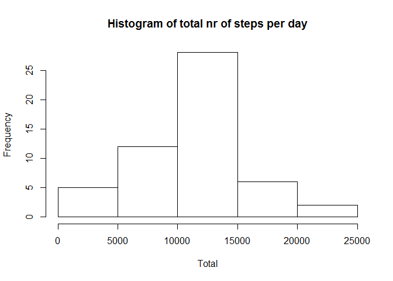
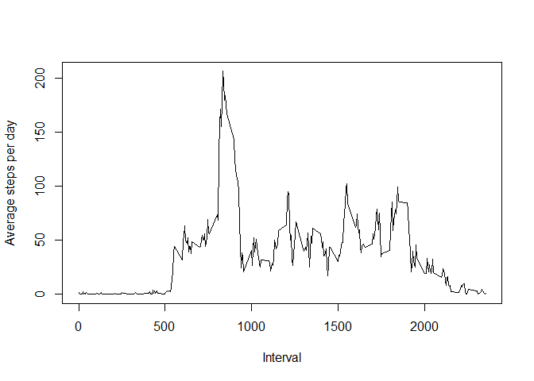

# Reproducible Research: Peer Assessment 1


## Loading and preprocessing the data


```r
options(scipen = 1, digits = 2)
data <- read.csv("activity.csv", header=TRUE)
data$date <- as.Date(data$date, "%Y-%m-%d")
```

## What is mean total number of steps taken per day?


```r
library(dplyr)
library(ggplot2)
grp <- group_by(data, date)
x <- summarise(grp, total = sum(steps) )
ggplot(x,aes(x = date, y = total)) + geom_histogram(stat="identity")
```

 

```r
mean <- mean(x$total,na.rm=TRUE)
median <- median(x$total, na.rm=TRUE)
```

The mean total of steps taken per day is: 10766.19, and the median is 10765

## What is the average daily activity pattern?


```r
grp2 <- group_by(data, interval)
y <- summarise(grp2, avg = mean(steps, na.rm=TRUE))
plot(y$interval, y$avg,type="l", ylab="Average steps per day", xlab="Interval")
```

 

```r
maxStepsInterval <-  y[y$avg == max(y$avg),1]
```

The 5 minute interval with the maximum average of steps is interval nr 835

## Imputing missing values


```r
missingCount <- length(which(is.na(data$steps)))
```

There are 2304 rows with missing values


```r
y <- summarise(grp2, avg = mean(steps, na.rm=TRUE))
dataWithFixedSteps <- mutate(data, fix.steps = ifelse(!is.na(steps), steps, y$avg)) 
grp3 <- group_by(dataWithFixedSteps, date)
fx <- summarise(grp3, total = sum(fix.steps) )
ggplot(fx,aes(x = date, y = total)) + geom_histogram(stat="identity")
```

 


```r
fixedmean <- mean(fx$total,na.rm=TRUE)
fixedmedian <- median(fx$total, na.rm=TRUE)
```

The mean and median of the fixed data is 10766.19  and 10766.19


## Are there differences in activity patterns between weekdays and weekends?


```r
library(lattice)
dataWithFactor <- mutate(dataWithFixedSteps, weekFactor = ifelse(weekdays(date) %in% c("Saturday", "Sunday"), "weekend","weekday"))
dataWithFactor$weekFactor <- as.factor(dataWithFactor$weekFactor)
grpWeek <- group_by(dataWithFactor, interval, weekFactor)
summaryWeek <- summarise(grpWeek, weekAvg = mean(fix.steps))
xyplot(summaryWeek$weekAvg ~ summaryWeek$interval | summaryWeek$weekFactor, layout = c(1,2), xlab="Interval", ylab="Number of steps",type="l")
```

 
